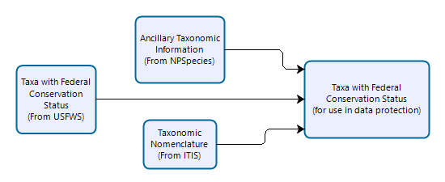

---
output:
  word_document: default
  pdf_document: default
bibliography: references.bib
csl: national-park-service-DRR.csl
nocite: '@*'
---

```{=html}
<!--- For more information on using this template, please see the accompanying documentation at: 

Overview of DRR Templates: https://nationalparkservice.github.io/DRR_Template/

Specific Instructions on filling out this template:
https://nationalparkservice.github.io/DRR_Template/HowToUseThisTemplate.html
--->
```
```{r user_edited_parameterss, include=FALSE}
# The title of your DRR.
title <- "Invasive Plant Monitoring for the Heartland Inventory and Monitoring Network: 2006-2022 - Data Release Report"

# Optional and should only be included if publishing to the semi-official DRR series. Contact Joe if you are. If not, leave as NULL
reportNumber <- NULL

# This should match the Data Store Reference ID for this DRR. Eventually we should be able to pull this directly from the data package metadata.
DRR_DSRefID <- 2302709

#Author names and affiliations:
# list the authors. If an author has multiple institutional affiliations, you must list the author multiple times. In this example, Jane Doe is listed twice because she has two affiliations.
authorNames <- c("Abigail Hobbs", "Craig Young", "Jennifer Haack-Gaynor")

# List author affiliations.
authorAffiliations <- c("NPS Inventory and Monitoring Division, 1201 Oakridge Dr., Suite 150, Fort Collins, Colorado", "Heartland Network, Wilson's Creek National Battlefield, 6424 West Farm Road 182, Republic, MO 65738", "Heartland Network, Wilson's Creek National Battlefield, 6424 West Farm Road 182, Republic, MO 65738")

# List the ORCID iDs for each author in the format "(xxxx-xxxx-xxxx-xxxx)".
authorORCID <- c("(0009-0004-9679-3961)", "(0000-0002-1687-8825)", "(0000-0003-4497-5128)")

# Replace the text below with your abstract.
DRRabstract <- "The Heartland Network (HTLN) consists of fifteen parks within the east central U.S. ranging north to south from Minnesota to Arkansas and from east to west from Ohio to Kansas. A monitoring program was established in 2006 to collect invasive plant occurrence and cover class data in thirteen network parks. Invasive plants were chosen for monitoring because they fragment native ecosystems, displace native plants and animals, and alter ecosystem function. The purpose of the monitoring program is to determine trends in species occupancy in order to inform management needs in HTLN parks. From these data the species trends for all parks were generated. In 2024, the data were then processed for dissemination by the Inventory and Monitoring Division (IMD), complying with Executive Order 13642, Making Open and Machine Readable the New Default for Government Information. A processed tabular dataset has been created using the data provided from the parks. The dataset contains 18 columns, 35363 observations, and 123 unique species."

# DataStore reference ID for the data package associated with this report. You must have at least one data package.Eventually, we will automate importing much of this information from metadata.
dataPackageRefID <- c(2303109)

# Must match title in DataStore and metadata
dataPackageTitle <- "Invasive Plant Monitoring for the Heartland Inventory and Monitoring Network: 2006-2022 - Data Package"

# Must match descriptions in the data package metadata
dataPackageDescription <- "Processed data files for Invasive Plant Monitoring for the Heartland Network"

# generates your data package DOI based on the data package DataStore reference ID. This is different from the DRR DOI! No need to edit this.
dataPackageDOI <- paste0("https://doi.org/10.57830/", dataPackageRefID)

# list the file names in your data package. Do NOT include metadata files.
dataPackage_fileNames <- c(
  "HTLN_InvasivePlants_Monitoring.csv"
)

# list the approximate size of each data file. Make sure the order corresponds to the order of of the file names in dataPackage_fileNames
dataPackage_fileSizes <- c("8.6 MB")

# list a short, one-line description of each data file. Descriptions must be in the same order as the filenames.
dataPackage_fileDescript <- c(
  "HTLN Invasive Plants Monitoring data.")
```

```{r setup_do_not_edit, include=FALSE}
RRpackages <- c("markdown",
                "rmarkdown",
                "pander",
                "knitr",
                "yaml",
                "kableExtra",
                "devtools",
                "tidyverse")

inst <- RRpackages %in% installed.packages()
if (length(RRpackages[!inst]) > 0) {
  install.packages(RRpackages[!inst], dep = TRUE, repos = "https://cloud.r-project.org")
}
lapply(RRpackages, library, character.only = TRUE)

options(download.file.method = 'wininet')
devtools::install_github("EmilyMarkowitz-NOAA/NMFSReports")
library(NMFSReports)
devtools::install_github("nationalparkservice/QCkit")
library(QCkit)
```

*`r (paste0("https://doi.org/10.38750/", DRR_DSRefID))`*

```{r title_do_not_edit, echo=FALSE, results="asis"}
date <- format(Sys.time(), "%d %B, %Y")
cat("#", title, "\n")
if (!is.null(reportNumber)) {
  subtitle <- paste0("Data Release Report ", reportNumber)
  cat("###", subtitle)
}
```

```{r authors_do_not_edit, echo=FALSE, results="asis"}
author_list <- data.frame(authorNames, authorAffiliations, authorORCID)
unique_authors <- author_list %>% distinct(authorNames,
                                           .keep_all = TRUE)
unique_affiliation <- author_list %>% distinct(authorAffiliations,
                                              .keep_all = TRUE)

#single author documents:
if(length(seq_along(unique_authors$authorNames)) == 1){

  for (i in seq_along(unique_authors$authorNames)) {
    curr <- unique_authors[i, ]
    
    #find all author affiliations
    aff <- author_list[which(authorNames == curr$authorNames),]
    aff <- aff$authorAffiliations  
    
    #identify order of affiliation(s) in a unique list of affiliations
    #build the superscripts for author affiliations
    super_script <- unique_affiliation$authorAffiliations %in% aff 
    super <- which(super_script == TRUE)
    script <- super
    
    if(length(seq_along(super)) > 1){
      script <- NULL
      j <- 1
      while(j < length(seq_along(super))){
        script <- append(script, paste0(super[j],","))
        j <- j+1
      }
      if(j == length(seq_along(super))){
        script <- append(script, super[j])
      }
    }
  }
   cat("#### ", curr$authorNames, sep="")
        if (is.na(curr$authorORCID)) {
        }
        if (!is.na(curr$authorORCID)) {
          orc <- paste0(" ", curr$authorORCID, "")
          cat({{ orc }})
        }
   cat(" ^",script,"^", " ", " ", sep="")
  
  #cat("#### ", unique_authors$authorNames, "^1^", sep="")
  #if(!is.na(authorORCID)){
  #  orc <- paste0(" https://orcid.org/", unique_authors$authorORCID)
  #  cat({{ orc }}, "\n")
  #}
  #cat("#### ", unique_authors$authorAffiliations, sep="")
}
  
#multi author documents:
if(length(seq_along(unique_authors$authorNames)) > 1){
  for (i in seq_along(unique_authors$authorNames)) {
    curr <- unique_authors[i, ]
    
    #find all author affiliations
    aff <- author_list[which(authorNames == curr$authorNames),]
    aff <- aff$authorAffiliations  
    
    #identify order of affiliation(s) in a unique list of affiliations
    #build the superscripts for author affiliations
    super_script <- unique_affiliation$authorAffiliations %in% aff 
    super <- which(super_script == TRUE)
    script <- super
    
    if(length(seq_along(super)) > 1){
      script <- NULL
      j <- 1
      while(j < length(seq_along(super))){
        script <- append(script, paste0(super[j],","))
        j <- j+1
      }
      if(j == length(seq_along(super))){
        script <- append(script, super[j])
      }
    }
    
    # if NOT the second-to-last author:
    if(i < (length(seq_along(unique_authors$authorNames)) - 1)){
      cat("#### ", curr$authorNames, " ", sep="")
        if (is.na(curr$authorORCID)) {
        }
        if (!is.na(curr$authorORCID)) {
          orc <- paste0(" ", curr$authorORCID, " ")
          cat({{ orc }})
        }
      cat( " ^", script, "^", ", ", " ", sep = "")
    }
    
    # if IS the second-to-last author
    if(i == (length(seq_along(unique_authors$authorNames)) - 1)){ 
       
      #if 3 or more authors, include a comma before the "and":
      if(length(seq_along(unique_authors$authorNames)) > 2){
        cat(curr$authorNames, sep="")
        if (is.na(curr$authorORCID)) {
        }
        if (!is.na(curr$authorORCID)) {
          orc <- paste0(" ", curr$authorORCID, " ")
          cat({{ orc }})
        }
        cat(" ^",script,"^", ", ", sep="")
        cat("and ", sep="")
      }
      
      #If only 2 authors, omit comma before "and":
      if(length(seq_along(unique_authors$authorNames)) == 2){
        cat("#### ", curr$authorNames, sep="")
        if (is.na(curr$authorORCID)) {
        }
        if (!is.na(curr$authorORCID)) {
          orc <- paste0(" ", curr$authorORCID, " ")
          cat({{ orc }})
        }
        cat(" ^",script,"^ ", sep = "")
        cat("and ", sep="")
      }
    }
    
    # if IS the Last author :
    if(i == length(seq_along(unique_authors$authorNames))){
      cat(curr$authorNames, sep="")
        if (is.na(curr$authorORCID)) {
        }
        if (!is.na(curr$authorORCID)) {
          orc <- paste0(" ", curr$authorORCID, " ")
          cat({{ orc }})
        }
      cat(" ^", script, "^", sep = "")
    }
  }
}
cat("\n\n")
for(i in 1:nrow(unique_affiliation)){
  cat("^",i,"^ ", unique_affiliation[i,2], "\n\n", sep="")
  }
```

# Abstract

`r DRRabstract` <!-- pulls from the abstract you supplied in user_edited_parameters - don't edit here! -->

<hr>

# Acknowledgements

Thank you to Alexa Ron, Issac Quevedo, Judd Patterson, Robert Baker, and Joe DeVivo from the IMD team in Fort Collins for their help and guidance in processing the machine readable data set and the construction of this report. Also thank you to Jennifer Haack-Gaynor and Gareth Rowell from the Heartland Network for providing additional guidance that helped in the construction of the data package, filling in gaps in the data that otherwise would have been left empty.

# Data Records

## Data Inputs
Invasive plant monitoring was conducted by Craig Young and Jennifer Haack-Gaynor in thirteen HTLN parks from 2006 to 2022. The data package described by this DRR was compiled from three separate datasets. Of these, one was a monitoring dataset, one was a sampling coordinates dataset, and one was a look-up table for cover class codes. Original data from the study are available from the NPS DataStore at https://irma.nps.gov/DataStore/Reference/Profile/2303267 (Young and Haack-Gaynor 2024).

## Summary of Datasets Created (required)

This DRR describes the *`r dataPackageTitle`* which contains a metadata file and one data file. These data were compiled and processed for dissemination by the National Park Service Inventory and Monitoring Division (IMD) and are available at `r dataPackageDOI` (see Table 1).

```{r FileTable, echo=FALSE}
filelist <- data.frame(dataPackage_fileNames, dataPackage_fileSizes, dataPackage_fileDescript)

knitr::kable(filelist, caption = paste0("**Table 1. ", dataPackageTitle, ": List of data files.**"), col.names = c("**File Name**", "**Size**", "**Description**"), format = "pandoc")
```

See Appendix for additional notes and examples.

# Data Quality Evaluation 

```{r dataAcceptanceCriteria, echo=FALSE, eval=FALSE}
# To turn off, set eval=FALSE.
# Generates a table of acceptance criteria for each of the data quality fields in your data package. Mitigations taken when data did not meet the acceptance criteria should be described textually in the Data Quality Evaluation section.

# Specify which columns in your data package are data quality fields in the dataQualityFields variable. In the example below, data quality fields/columns in the data package are listed in the format [FieldName]_flag. These data quality fields relate to the respective temporal, taxonomic, and  geographic data.

dataQualityFields <- c(
  "ScientificName_flag", 
  "Coordinate_flag"
  )

# Brief description of the acceptance criteria for each respective data quality field. The order of the acceptance criteria must match the order of the data quality fields. 

dataQualityAcceptanceCriteria <- c(
  "Taxon exists within Integrated Taxonomic Information System and GBIF",
  "Sampling location is within the park unit boundaries"
  )

data_criteria<-data.frame(dataQualityFields = str_remove(dataQualityFields, "_flag"), dataQualityAcceptanceCriteria)

data_criteria %>% 
  NMFSReports::format_cells(1:2, 1, "bold") %>% 
  knitr::kable(caption = "**Table 2. Acceptance criteria for data evaluated.**", col.names=c("**Field**", "**Acceptance Criteria**"), format="pandoc", align = 'c') 

```

```{r data_column_flagging, echo=FALSE, eval=FALSE}
# To turn off, set eval=FALSE.
# Generates a table summarizing QC at the column level within each file. All flagged columns are included. To add additional non-flagged columns, specify them with column names: cols=("my_unflagged_data1", "my_unflagged_data2)" or numbers: cols=c(1:4). All non-missing data in unflagged columns is assumed accepted.  If a file has no flagged columns and no specified custom columns, all values for that data file will be listed as "NA".

#set directory to the location of your data package:
path <- "C:/Users/ahobbs/DOI/NPS-CSO Data Science - Documents/Open Data/SECN/Monitoring/Anurans/03_final_data/Final 2011-2012 and 2014"
dc_flags <- QCkit::get_custom_flags(directory = path, output="columns")
dc_flags$`File Name` <- gsub(".csv", "", dc_flags$`File Name`)


colnames(dc_flags)[2]<-paste0("Measure", "^1^")
colnames(dc_flags)[4]<-paste0("A", "^2^")
colnames(dc_flags)[8]<-paste0("% Accepted", "^3^")

#Generate the table:
dc_flags %>% 
  knitr::kable(
    caption = '**Table 3: Summary of data quality flags for each column [A – Accepted; AE – Accepted but Estimated; P – Provisional; R – Rejected.]**',  
    format = "pandoc", 
    digits = 2, 
    align = 'c', 
    col.names = c("**File Name**", "**Measure^1^**", "**Number of Reocrds**", "**A^2^**", "**AE**", "**R**", "**P**", "**% Accepted^3^**")) %>%
kableExtra::add_footnote(
  c("The '_flag' suffix has been omitted from column names for brevity.",
    "All non-missing data in specified unflagged columns are considered accepted.",
    "% Accepted is calculated as the number of accepted (where A and AE are both considered accepted) divided by the total number of observations plus the number of missing observations."), 
  notation = "number"
  ) 

```

```{r data_package_flagging, echo=FALSE, eval=FALSE}
# To turn off, set eval=FALSE.
# Generates a table summarizing data quality across all flagged columns of each data file. To add additional non-flagged columns, specify them with column names: cols=("my_unflagged_data1", "my_unflagged_data2)" or numbers: cols=c(1:4). All non-missing data in unflagged columns is assumed accepted. If a file has no flagged columns and no specified custom columns, all values for that data file will be listed as "NA".

#set directory to the location of your data package
path<-"C:/Users/ahobbs/DOI/NPS-CSO Data Science - Documents/Open Data/SECN/Monitoring/Anurans/03_final_data/Final 2011-2012 and 2014"
dp_flags <- get_custom_flags(directory = path, output="files")

#generate table:
dp_flags %>% 
  kableExtra::kbl(caption = '**Table 4: Summary of data quality flags for the data package [A – Accepted; AE – Accepted but Estimated; P – Provisional; R – Rejected.]**',
                  format = "pandoc", 
                  col.names = c("**File Name**", "**A^1^**", "**AE**", "**R**", "**P**", "**% Accepted^2^**"),
                  digits=2, 
                  align = 'c') %>% 
  kableExtra::add_footnote(c("All non-missing data in specified unflagged columns are considered accepted.",
                             "% Accepted is calculated as the number of accepted (where A and AE are both considered accepted) divided by the total number of observations plus the number of missing observations."), notation = "number") 
```

The data within the data records listed above have been reviewed by staff in the NPS Inventory and Monitoring Division to ensure accuracy, completeness, and consistency with documented data quality standards, as well as for usability and reproducibility. No data quality flags were added, and the *`r dataPackageTitle`* is suitable for its intended use as of the date of processing (`r Sys.Date()`).

# Usage Notes

Users of the data package described in this report will find that column/attribute names were retained verbatim from the raw data with three exceptions: 1) In columns where the variables included units, **In[Units]** was appended to the end of the column name, 2) Some abbreviated column names have been spelled out for added clarity, and 3) the columns dwcType, BasisofRecord, ScientificName, and TaxonRank were added on behalf of the Inventory and Monitoring Division during data processing and follow Simple Darwin Core guidelines (Quevedo and Sherman 2023; Darwin Core Maintenance Group 2021; Darwin Core Task Group 2014). The EventTime column refers to the local time of day when the sample was collected within the Central Time Zone.

## Acquiring the Data Package

This data package is available for download from the NPS DataStore at `r dataPackageDOI` and can be directly imported into R data frames using the NPSutils package <https://doi.org/10.57830/2300651>

# Methods

```{r figure1, echo=FALSE, fig.cap="Example general workflow to include in the methods section."}
#
```

## Data Collection and Sample Processing Methods
The HTLN parks selected for the monitoring program include Arkansas Post National Memorial, Cuyahoga Valley National Park, Effigy Mounds National Monument, George Washington Carver National Monument, Herbert Hoover National Historic Site, Hopewell Culture National Historical Park, Homestead National Historical Park, Hot Springs National Park, Lincoln Boyhood National Memorial, Pea Ridge National Military Park, Pipestone National Monument, Tallgrass Prairie National Preserve, and Wilson's Creek National Battlefield. These thirteen parks contain a diverse array of habitats. Invasive plant monitoring was conducted from 2006 to 2022. In parks with less than 350 acres, sampling units were created by dividing existing park management units into polygons that were generally 1 to 3 acres (0.4 to 1.2 ha) in size with 2 acres as the target size. Between 50 to 79 polygon search units were employed per park. In parks with greater than 350 acres, systematically located line search units were established in a GIS using a random start. Line search units ranged from 200 to 400 meters in length dependent on park size and accessibility. Between 101 to 822 line search units were employed per park. Both natural and restored areas were selected for sampling, except where special equipment or permission would have been required for site access. Additionally, developed areas were excluded from sampling. Within sample plots, invasive plants were identified to the species level. For a detailed description of all park sample sites and sampling methodologies, please see Kull et al. (2022). In small parks, methods included making three equidistant passes through each polygon search unit in an east-west direction recording invasive plant cover classes that occur within approximately 1.5 to 6 meters on either side. In large parks, methods included making one pass along each line search unit in an east-west direction recording invasive plant cover classes that occur within approximately 1.5 to 6 meters on either side. Additionally, geographic coordinates were recorded at each sample site.

## Data Processing

- Code values for CoverClassInMetersSquared were directly integrated into the column variables to clarify the meaning of each value (Kull et al. 2022)

- Within the CoverClassInMetersSquared column of the raw data file, the code used to represent '1,000–4,999.9' was incorrectly listed as '7', '8', and '9', when it should have only been '7'. This was corrected with the approval of HTLN's Haack-Gaynor JL.

- A missing decimal was added to the LongitudeInDecimalDegrees for Hopewell Culture National Historical Park.

- Capitalization was standardized and columns were formatted for consistency.

- Additional Darwin Core fields were appended to fit the Simple Darwin Core Guidelines (Darwin Core Task Group 2014) and to add context to the source data.

## Code Availability

The scripts used to create this report and associated datasets are available on the NPS DataStore repository at https://doi.org/10.57830/2303268 (Hobbs 2024).

# References

::: {#refs}
:::

```{r Listing, ref.label=knitr::all_labels(), echo=FALSE, eval=FALSE}

```

\pagebreak


```{r session-info, eval=FALSE, echo=FALSE, cache=FALSE}
sessionInfo()
Sys.time()
```
